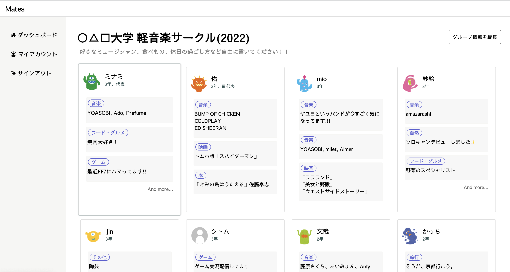
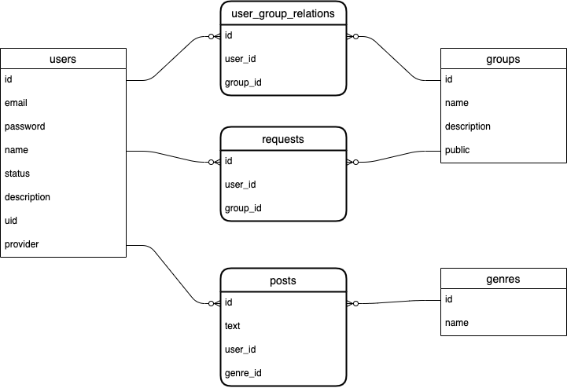

# Mates
会社や部活、アルバイトなどのチームメンバー同士で簡単な自己紹介をするサービスです。 
自分の「好きなもの」「興味のあるもの」についてシェアすることができます。 
コロナ禍のリモートワーク等で雑談の機会が減ってきている中、話題作りのきっかけとして活用してもらえると嬉しいです。 

 

# 使用技術
* Ruby 2.6.5
* Rails 6.0.4
* MySQL 5.7
 

# DB設計

 

# 主な機能
* ユーザー登録、ログイン機能（devise）
  - Facebook認証を利用したログイン機能
* グループの作成、編集機能
* グループ／ユーザーの検索機能
* グループへの参加リクエスト機能
* グループへの別ユーザーの追加(招待)機能
* 「好きなもの」の投稿、編集、削除機能