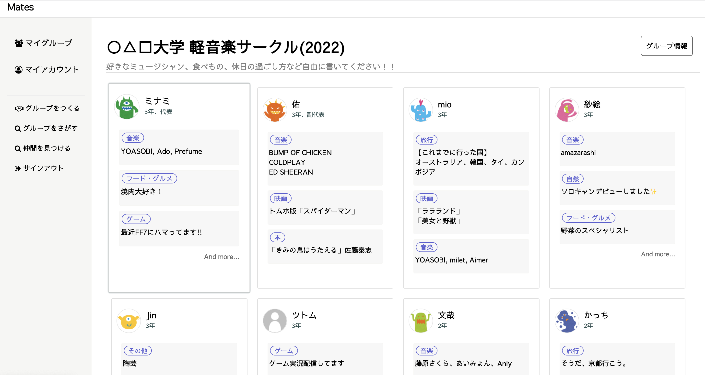
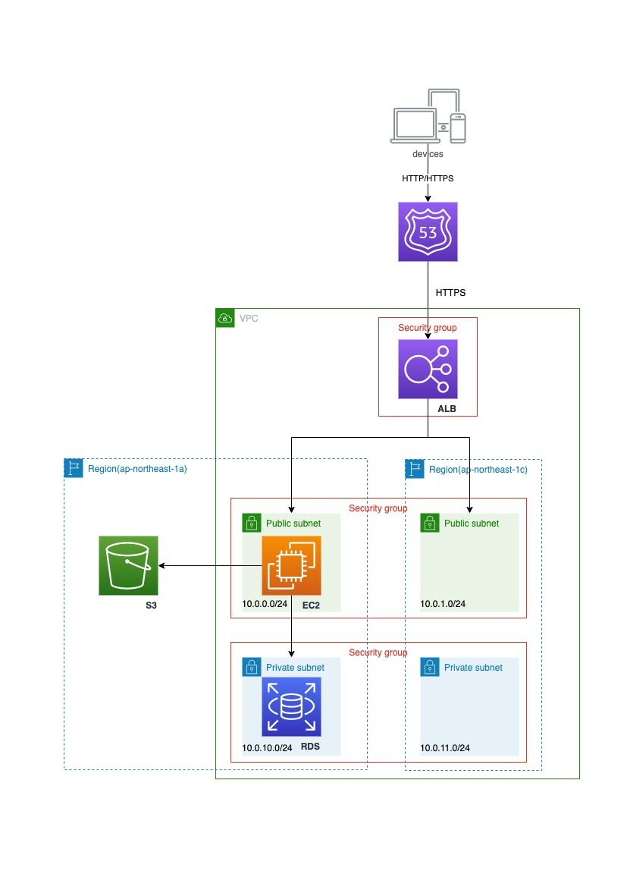
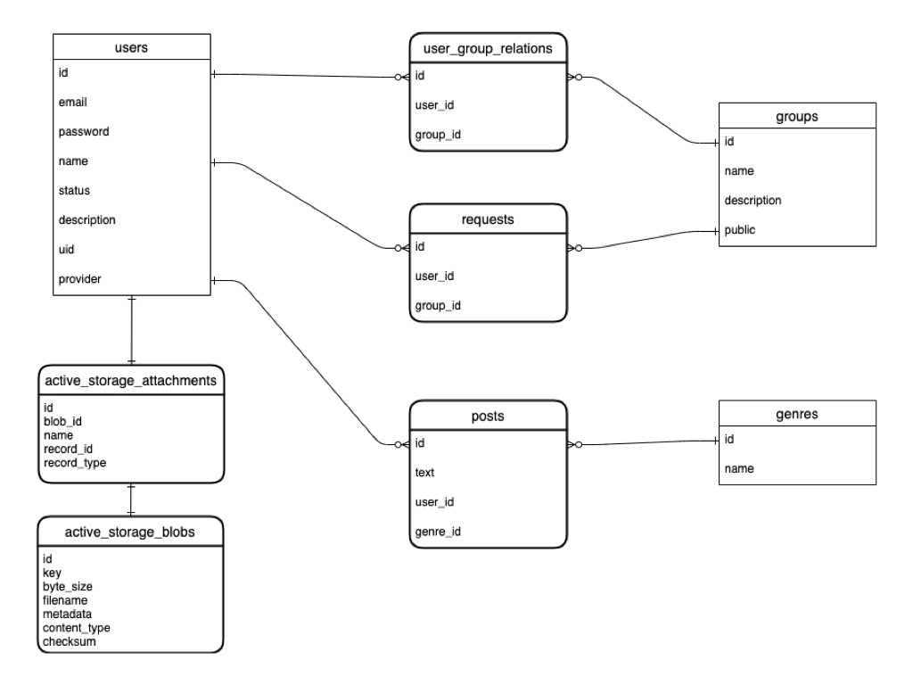

# Mates
### ~~URL: http s://app-mates.com~~ 公開を終了しました。
部活やアルバイト、社内チームなどのグループメンバー同士で簡単な自己紹介をするサービスです。 
自分の「好きなもの」「興味のあるもの」についてシェアすることができます。 
話題作りのきっかけとして活用してもらえると嬉しいです。 
（閲覧用のゲストログインも用意しています。） 

 

## 開発背景
### 課題
コロナ禍でリモートワークが増えるなどコミュニケーションスタイルが変化し、
チームメンバーとのつながりを感じにくくなってきている。 
### 仮説
気軽に雑談をしたり昼食を共にする機会が減ったことで、メンバーが打ち解けるまでに以前よりも時間がかかる。 

### 解決策
自分の興味のあること、好きなこと、過去のエピソードなどについて簡単に共有することで、
それぞれの人柄やお互いの共通点が見えるようになり、ちょっとした会話のきっかけを増やすことにつながる。
 

## 使用技術
### フロントエンド
* HTML
* CSS, Sass
* JavaScript

### バックエンド
* Ruby 2.6.5
* Ruby on Rails 6.0.4

### サーバー
* Nginx
* Puma

### データベース
* MySQL 5.7

### インフラ
* AWS
  * VPC
  * EC2
  * RDS
  * Route 53
  * ALB
  * S3

### その他
* Facebook API
* Capistrano
 

## インフラ構成図

 

## DB設計

 

## 主な機能
### ユーザー機能
* 新規登録、ログイン、ログアウト機能（devise）
* Facebook認証を利用した新規登録、ログイン機能
* プロフィールの編集機能
* 登録削除(退会)機能
* ユーザー検索機能

### 「好きなもの」に関する機能
* 新規投稿、編集、削除機能
* 投稿内容のカテゴリ選択

### グループ機能
* グループの新規作成機能
* グループ情報の編集機能
* グループの公開／非公開選択
* 公開グループの検索機能
* 公開グループへの参加リクエスト機能
  * 参加リクエストの承認／拒否
  * 参加リクエストの取り下げ
* グループへのユーザーの追加(招待)機能
* グループからの脱退機能
* グループの削除機能